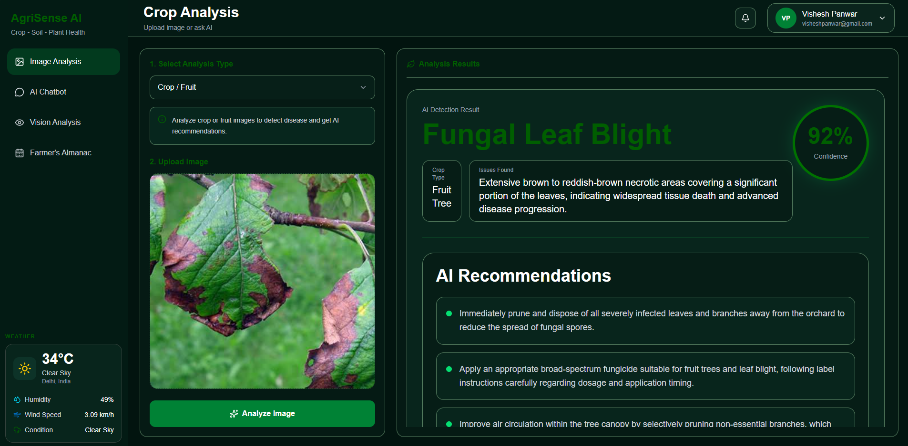
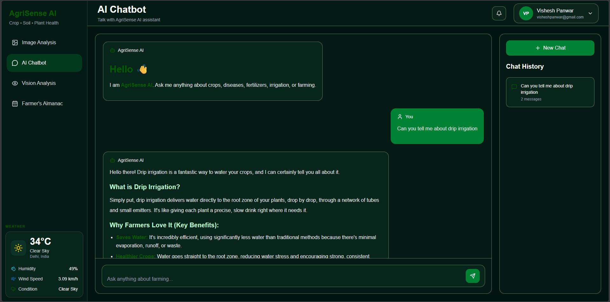
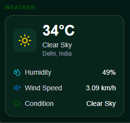
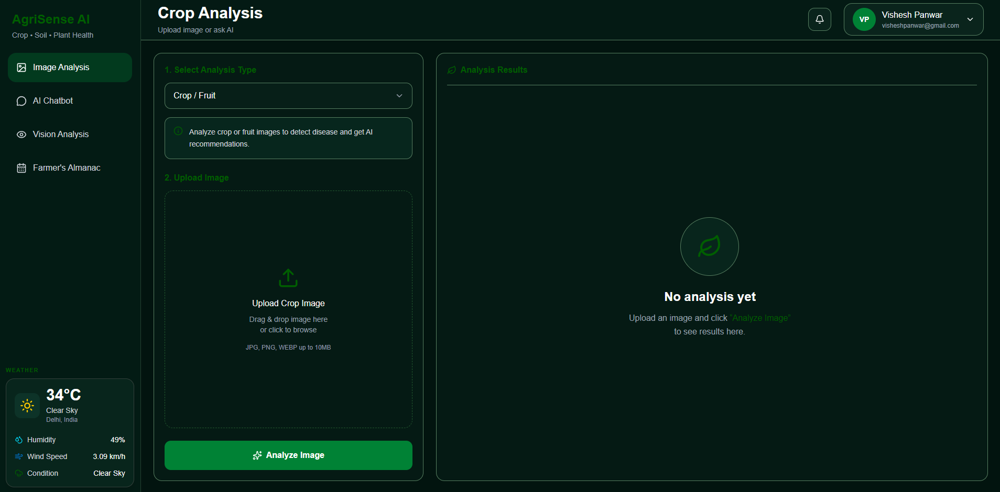
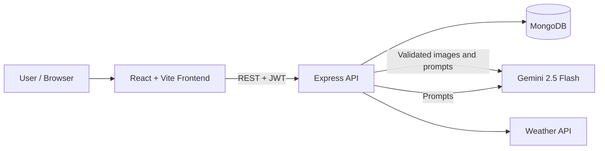

# 🌱 AgriSense AI – Smart Agriculture Assistant

[](https://agriculture-ai-frontend.vercel.app/)


AgriSense AI is a full-stack, AI-powered platform that helps farmers make informed decisions. Upload a photo of a crop to get a disease diagnosis with severity and treatment suggestions, ask an agriculture-focused chatbot for guidance, and get weather-based farming insights, all in one place.

**🔗 Live demo:** https://agriculture-ai-frontend.vercel.app/

> ⚠️ AgriSense AI provides AI-generated suggestions for educational and portfolio purposes. Always verify diagnoses and treatments with a local agronomist or agriculture extension office before applying pesticides or other treatments.

---

## 📸 Screenshots

<!-- Screenshots are stored in the Docs folder. -->

| Crop Disease Analysis | AI Chatbot |
| --- | --- |
|  |  |

| Weather Insights | Dashboard |
| --- | --- |
|  |  |

---

## 📑 Table of Contents

- [Features](#-features)
- [Architecture](#-architecture)
- [Tech Stack](#-tech-stack)
- [Project Structure](#-project-structure)
- [Getting Started](#-getting-started)
- [API Reference](#-api-reference)
- [Vision AI Workflow](#-vision-ai-workflow)
- [Security](#-security)
- [Limitations & Design Decisions](#️-limitations--design-decisions)
- [Roadmap](#-roadmap)
- [Author](#-author)

---

## 🚀 Features

### 🤖 AI Agriculture Chatbot
- Agriculture-specific assistant powered by Gemini
- Crop management guidance
- Pest and disease recommendations
- Fertilizer and irrigation suggestions
- Farming best practices

### 🌿 Crop Disease Analysis
- Upload crop or plant images
- AI-powered disease detection
- Plant health assessment and severity analysis
- Treatment recommendations

### 🌦 Weather Intelligence
- Real-time weather information
- Farming-specific weather insights
- Recommendations based on current conditions

### 📅 Agricultural Almanac
- Seasonal farming guidance
- Crop planning support
- Agricultural calendar assistance

### 🔐 Authentication
- User registration and login
- JWT-based authentication
- Passwords hashed with bcryptjs

### 📊 Smart Analysis Tools
- Crop health analysis
- AI-generated farming insights and recommendations

---

## 🏗 Architecture



**How a request flows:** the React frontend calls the Express API with a JWT. Protected routes pass through auth and validation middleware, then controllers delegate to service modules that talk to Gemini, the weather API, or MongoDB.

---

## 🛠 Tech Stack

| Layer | Technologies |
| --- | --- |
| **Frontend** | React.js, Vite, Tailwind CSS, Axios, React Router DOM, Framer Motion |
| **Backend** | Node.js, Express.js, MongoDB, Mongoose, JWT, Multer, CORS, Dotenv |
| **AI** | Google Gemini 2.5 Flash, Google GenAI SDK |
| **Deployment** | Vercel (frontend and backend), GitHub |

---

## 📁 Project Structure

```
Agriculture-Ai/
│
├── frontend/
│   ├── src/
│   ├── public/
│   └── package.json
│
├── backend/
│   ├── src/
│   │   ├── controllers/
│   │   ├── routes/
│   │   ├── middleware/
│   │   ├── services/
│   │   ├── models/
│   │   ├── config/
│   │   ├── utils/
│   │   └── app.js
│   ├── server.js
│   ├── package.json
│   ├── .env.example
│   └── vercel.json
│
└── README.md
```

---

## ⚙️ Getting Started

### Prerequisites

- Node.js 20.19+ or 22.12+
- A MongoDB database (local or [MongoDB Atlas](https://www.mongodb.com/atlas))
- A [Gemini API key](https://aistudio.google.com/)
- A weather API key

### 1. Clone the repository

```bash
git clone https://github.com/VisheshPanwar2003/Agriculture-Ai.git
cd Agriculture-Ai
```

### 2. Set up the backend

```bash
cd backend
npm install
cp .env.example .env
```

Open `.env` and fill in your values:

```env
PORT=8000
MONGODB_URI=your_mongodb_connection_string
JWT_SECRET=replace_with_a_long_random_string
GEMINI_API_KEY=your_gemini_api_key
WEATHER_API_KEY=your_weather_api_key
```

Run the server:

```bash
# Development
npm run dev

# Production
npm start
```

Backend runs at `http://localhost:8000`.

### 3. Set up the frontend

```bash
cd frontend
npm install
npm run dev
```

Frontend runs at `http://localhost:5173`.
The frontend uses `http://localhost:8000` as its local API default. To override it locally, copy `frontend/.env.example` to `frontend/.env` and set `VITE_API_URL`.

For Vercel deployment, set `VITE_API_URL` in the frontend project's Environment Variables to the public base URL of the deployed backend (for example, `https://your-backend.example.com`). Redeploy the frontend after changing this value. The production frontend will show a configuration error instead of sending API requests to `localhost` if this variable is missing.

---

## 📡 API Reference

| Method | Endpoint | Description | Auth |
| --- | --- | --- | --- |
| POST | `/auth/signup` | Create an account | No |
| POST | `/auth/login` | Log in and receive a JWT | No |
| POST | `/chatbot/new` | Create a chat | Yes |
| POST | `/chatbot/chat` | Send a message to a chat | Yes |
| GET | `/chatbot/history` | List the current user's chats | Yes |
| GET | `/chatbot/:chat_id` | Read one of the current user's chats | Yes |
| POST | `/vision/analyze` | Analyze an uploaded image and optional question | Yes |
| POST | `/analysis/predict` | Analyze an uploaded crop image | Yes |
| GET | `/weather/:city` | Get weather for a city | Yes |
| GET | `/almanac/daily` | Get today's almanac | Yes |
| GET | `/almanac/seasonal/:region` | Get seasonal farming guidance | Yes |
| GET | `/almanac/crop-ai/:crop_name` | Get crop data and AI insights | Yes |

---

## 📸 Vision AI Workflow

1. The user uploads a crop image.
2. The image is received and size/type checked with **Multer**.
3. **Gemini Vision** analyzes the image.
4. The model identifies diseases and plant health issues.
5. A severity assessment is generated.
6. Treatment recommendations are returned to the user.

---

## 🔒 Security

- JWT-based authentication
- Password hashing with bcryptjs
- Request validation with Express Validator
- CORS configuration
- API keys and secrets stored in environment variables and excluded from Git via `.gitignore`

---

## ⚖️ Limitations & Design Decisions

- **Why Gemini instead of a custom CNN:** a multimodal model gave good results without needing a large labeled dataset, and a single model handles both image analysis and written advice. The trade-off is less control over the model, per-request API cost, and output that can vary between runs.
- **Not a replacement for an agronomist:** diagnoses are AI-generated suggestions and should be verified before any treatment is applied.
- **Photo quality matters:** blurry, dark, or distant images reduce accuracy.
- **No formal accuracy benchmark yet:** evaluating the vision endpoint against a labeled dataset such as PlantVillage is on the roadmap.
- **External dependencies:** the app relies on the Gemini and weather APIs, so availability and rate limits of those services affect the experience.

---

## 🗺 Roadmap

**In progress / next up**
- [ ] Structured, schema-validated JSON output from the vision endpoint
- [ ] Accuracy evaluation on a public plant-disease dataset
- [ ] Rate limiting and stricter upload validation
- [ ] Per-user scan history
- [ ] Automated tests and CI (GitHub Actions)

**Future ideas**
- [ ] Multi-language support (Hindi and regional languages)
- [ ] Voice-enabled farming assistant
- [ ] Market (mandi) price lookup
- [ ] Crop yield prediction
- [ ] Farm management dashboard
- [ ] Mobile app / PWA
- [ ] IoT sensor integration

---

## 👨‍💻 Author

**Vishesh Panwar** – AI & Full Stack Developer

- GitHub: [@VisheshPanwar2003](https://github.com/VisheshPanwar2003)
- LinkedIn: [linkedin.com/in/visheshpanwar3](https://linkedin.com/in/visheshpanwar3)

---

## 📜 License

This project is developed for educational, research, and portfolio purposes.
