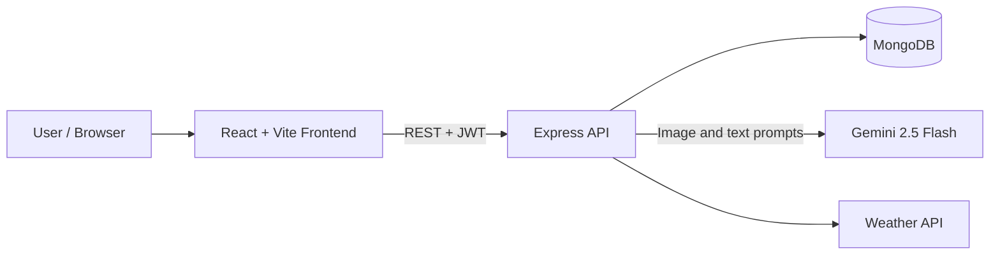

# 🌱 AgriSense AI – Smart Agriculture Assistant

[](https://agriculture-ai-frontend.vercel.app/)


AgriSense AI is a full-stack farming assistant. It provides crop image analysis, an agriculture-focused chatbot, city weather, a seasonal planner, reported mandi prices, and a directory of government schemes. The frontend is a React single-page app; the backend is an Express API backed by MongoDB.

**🔗 Live demo:** https://agriculture-ai-frontend.vercel.app/

> ⚠️ AgriSense AI provides AI-generated suggestions for educational and portfolio purposes. Always verify diagnoses and treatments with a local agronomist or agriculture extension office before applying pesticides or other treatments.

---

## 📸 Screenshots

<!-- Screenshots are stored in the Docs folder. -->

| Crop Disease Analysis | AI Chatbot |
| --- | --- |
|  |  |

| Weather Insights | Dashboard |
| --- | --- |
|  |  |

---

## 📑 Table of Contents

- [Features](#-features)
- [Architecture](#-architecture)
- [Tech Stack](#-tech-stack)
- [Project Structure](#-project-structure)
- [Getting Started](#-getting-started)
- [API Reference](#-api-reference)
- [Vision AI Workflow](#-vision-ai-workflow)
- [Security](#-security)
- [Limitations & Design Decisions](#️-limitations--design-decisions)
- [Roadmap](#-roadmap)
- [Continuous Integration](#-continuous-integration)
- [Author](#-author)

---

## 🚀 Features

### 🤖 AI Agriculture Chatbot
- Agriculture-specific assistant powered by Gemini
- Crop management guidance
- Pest and disease recommendations
- Fertilizer and irrigation suggestions
- Farming best practices

### 🌿 Crop Disease Analysis
- Upload crop or plant images
- AI-powered disease detection
- Plant health assessment and severity analysis
- Treatment recommendations

### 🌦 Weather Intelligence
- Real-time weather information
- Farming-specific weather insights
- Recommendations based on current conditions

### 📅 Agricultural Almanac
- Seasonal farming guidance
- Crop planning support
- Agricultural calendar assistance

### 📈 Mandi Price Lookup
- Search reported AGMARKNET wholesale prices by state and commodity
- Narrow results by district and market
- Compare minimum, modal, and maximum prices per quintal
- Uses CEDA Agri Market Data as a fallback when data.gov.in is unavailable; CEDA results are labeled with their source and latest available date

### 🏛️ Farmer Schemes Directory
- Browse a starter directory of central farmer schemes
- Search by scheme name or support category
- Open official myScheme pages to verify current eligibility and apply

### 🔐 Authentication
- User registration and login
- JWT-based authentication
- Passwords hashed with bcryptjs
- Change password and invalidate sessions on other devices
- Location and AI response language preferences
- Language preferences for AI responses: English, Hindi, Bengali, Marathi, Punjabi, Tamil, and Telugu

### 📊 Smart Analysis Tools
- Crop health analysis
- AI-generated farming insights and recommendations

---

## 🏗 Architecture



**How a request flows:** the React frontend calls the Express API with a JWT. Protected routes pass through auth and validation middleware, then controllers delegate to service modules that talk to Gemini, the weather API, or MongoDB.

---

## 🛠 Tech Stack

| Layer | Technologies |
| --- | --- |
| **Frontend** | React.js, Vite, Tailwind CSS, Axios, React Router DOM, Framer Motion |
| **Backend** | Node.js, Express.js, MongoDB, Mongoose, JWT, Multer, CORS, Dotenv |
| **AI** | Google Gemini 2.5 Flash, Google GenAI SDK |
| **Deployment** | Frontend demo on Vercel; backend can run on a Node.js host; GitHub Actions CI |

---

## 📁 Project Structure

```
Agriculture-Ai/
│
├── frontend/
│   ├── src/
│   ├── public/
│   ├── package.json
│   ├── package-lock.json
│   └── .env.example
│
├── backend/
│   ├── src/
│   │   ├── controllers/
│   │   ├── routes/
│   │   ├── middleware/
│   │   ├── services/
│   │   ├── models/
│   │   ├── config/
│   │   ├── utils/
│   │   └── app.js
│   ├── server.js
│   ├── package.json
│   ├── package-lock.json
│   └── .env.example
│
├── .github/workflows/ci.yml
└── README.md
```

---

## ⚙️ Getting Started

### Prerequisites

- Node.js 20.19+ or 22.12+
- A MongoDB database (local or [MongoDB Atlas](https://www.mongodb.com/atlas))
- A [Gemini API key](https://aistudio.google.com/)
- An OpenWeather API key
- A data.gov.in API key is optional; mandi lookup also tries AGMARKNET and CEDA sources

### 1. Clone the repository

```bash
git clone https://github.com/VisheshPanwar2003/Agriculture-Ai.git
cd Agriculture-Ai
```

### 2. Set up the backend

```bash
cd backend
npm ci
cp .env.example .env
```

Open `backend/.env` and set your own values. Keep this file private and never commit it:

```env
PORT=8000
MONGODB_URI=your_mongodb_connection_string
JWT_SECRET=replace_with_a_long_random_string
GEMINI_API_KEY=your_gemini_api_key
WEATHER_API_KEY=your_weather_api_key
DATA_GOV_API_KEY=your_data_gov_in_api_key
```

`MONGODB_URI`, `JWT_SECRET`, `GEMINI_API_KEY`, and `WEATHER_API_KEY` are needed for their respective features. `DATA_GOV_API_KEY` is optional; without it, mandi lookup tries its other configured providers. The example sets `PORT=8000`; the backend defaults to port `5000` if `PORT` is omitted.

Run the server:

```bash
# Development
npm run dev

# Production
npm start
```

With the example configuration, the backend runs at `http://localhost:8000`.

### 3. Set up the frontend

```bash
cd frontend
npm ci
npm run dev
```

Run the frontend commands from the repository root in a second terminal. The frontend runs at `http://localhost:5173` and uses `http://localhost:8000` as its development API default. To override it, copy `frontend/.env.example` to `frontend/.env` and set `VITE_API_URL`.

For Vercel deployment, set `VITE_API_URL` in the frontend project's Environment Variables to the public base URL of the deployed backend (for example, `https://your-backend.example.com`). Redeploy the frontend after changing this value. The production frontend will show a configuration error instead of sending API requests to `localhost` if this variable is missing.

The backend CORS allowlist in `backend/src/app.js` must include the deployed frontend origin. The Vercel frontend URL is allowed by default; add any other frontend domain to that allowlist before deploying it.

---

## 📡 API Reference

| Method | Endpoint | Description | Auth |
| --- | --- | --- | --- |
| POST | `/auth/signup` | Create an account | No |
| POST | `/auth/login` | Log in and receive a JWT | No |
| POST | `/auth/change-password` | Change password and invalidate other sessions | Yes |
| POST | `/chatbot/new` | Create a chat | Yes |
| POST | `/chatbot/chat` | Send a message to a chat | Yes |
| GET | `/chatbot/history?offset=0&limit=25` | Get a page of the current user's chat summaries (maximum 50 per page) | Yes |
| GET | `/chatbot/:chat_id` | Read one of the current user's chats | Yes |
| POST | `/vision/analyze` | Analyze an uploaded image and optional question (`file` multipart field) | Yes |
| POST | `/analysis/predict` | Analyze an uploaded crop image (`file` multipart field) | Yes |
| GET | `/weather/:city` | Get weather for a city | Yes |
| GET | `/almanac/daily` | Get today's almanac | Yes |
| GET | `/almanac/seasonal/:region` | Get seasonal farming guidance | Yes |
| GET | `/almanac/crop-ai/:crop_name` | Get crop data and AI insights | Yes |
| GET | `/market/prices?state=...&commodity=...` | Get reported mandi prices; optional `district`, `market`, `offset`, and `limit` filters (maximum 10 rows per request) | Yes |
| GET | `/schemes?search=...&category=...` | Search the farmer scheme directory | Yes |

---

## 📸 Vision AI Workflow

1. The user uploads a crop image.
2. The image is received and size/type checked with **Multer**.
3. **Gemini Vision** analyzes the image.
4. The model identifies diseases and plant health issues.
5. A severity assessment is generated.
6. Treatment recommendations are returned to the user.

---

## 🔒 Security

- JWT-based authentication
- Password hashing with bcryptjs
- Input checks in route handlers and image upload restrictions (JPG, PNG, WEBP; maximum 10 MB)
- CORS origin allowlist
- Password changes increment a token version so tokens on other devices stop working
- API keys and secrets stored in environment variables and excluded from Git via `.gitignore`
- The frontend stores JWTs in browser local storage; use HTTPS in production and protect accounts from untrusted scripts

---

## ⚖️ Limitations & Design Decisions

- **Why Gemini instead of a custom CNN:** a multimodal model gave good results without needing a large labeled dataset, and a single model handles both image analysis and written advice. The trade-off is less control over the model, per-request API cost, and output that can vary between runs.
- **Not a replacement for an agronomist:** diagnoses are AI-generated suggestions and should be verified before any treatment is applied.
- **Photo quality matters:** blurry, dark, or distant images reduce accuracy.
- **No formal accuracy benchmark yet:** evaluating the vision endpoint against a labeled dataset such as PlantVillage is on the roadmap.
- **External dependencies:** the app relies on the Gemini and weather APIs, so availability and rate limits of those services affect the experience.
- **Mandi data fallback:** when data.gov.in is unavailable, the app can use CEDA Agri Market Data. Results are labeled with their source and as the latest available report rather than a live quote. Check each provider's current terms before reusing or redistributing its data.
- **Almanac scope:** seasonal crop lists are broad India-level suggestions, not district-specific agricultural advisories. Confirm local sowing dates, water availability, and crop suitability before planting.
- **Schemes directory:** the app contains a small starter list. Check the linked official scheme source for current eligibility, rules, and application steps.
- **Backend protection:** request rate limiting and automated backend tests are not yet configured.

---

## 🗺 Roadmap

**In progress / next up**
- [ ] Accuracy evaluation on a public plant-disease dataset
- [ ] Rate limiting for authentication and AI endpoints
- [ ] Per-user scan history
- [ ] Automated backend and integration tests

**Future ideas**
- [x] Multi-language interface and AI response preferences
- [ ] Voice-enabled farming assistant
- [x] Market (mandi) price lookup
- [ ] Crop yield prediction
- [ ] Farm management dashboard
- [ ] Mobile app / PWA
- [ ] IoT sensor integration

---

## 🔁 Continuous Integration

The workflow in `.github/workflows/ci.yml` runs on pushes, pull requests, and manual dispatch. It uses Node.js 22 and checks:

- Frontend dependency installation, ESLint, and production build
- Backend dependency installation and JavaScript syntax

There is no automated backend test suite yet; the backend job currently performs syntax checks only.

---

## 👨‍💻 Author

**Vishesh Panwar** – AI & Full Stack Developer

- GitHub: [@VisheshPanwar2003](https://github.com/VisheshPanwar2003)
- LinkedIn: [linkedin.com/in/visheshpanwar3](https://linkedin.com/in/visheshpanwar3)

---

## 📜 License

This project is developed for educational, research, and portfolio purposes.
